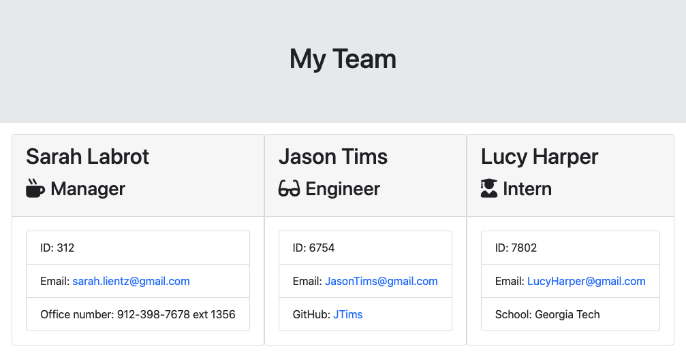

# Employee-Profile-Generator
A command-line application that takes information about employees and generates an HTML page with professional profiles for each person. This application uses Django templates and illustrates my proficiency with Python. 

This application demonstrates my ability to build and use a Node.js command-line application. With this application you can easily generate and update a team profile HTML page that displays a summary for each person on the team. Since testing is key to great coding, I have unit tests for each part of my code (i.e. the employees). 

For your convenience, I have created a walkthrough video demonstrating the apps functionality and all the tests passing. Thank you for visiting :)

## Walkthrough Video
[SARAH'S DEMO](https://watch.screencastify.com/v/7ij2OAnTyfrxvhzikm3g)

Below is an image of the generated HTML’s appearance and functionality:

